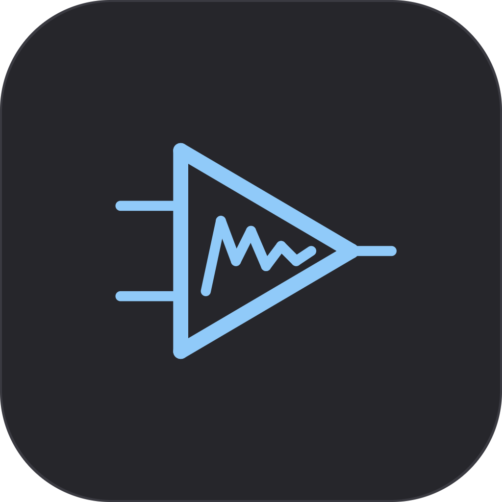
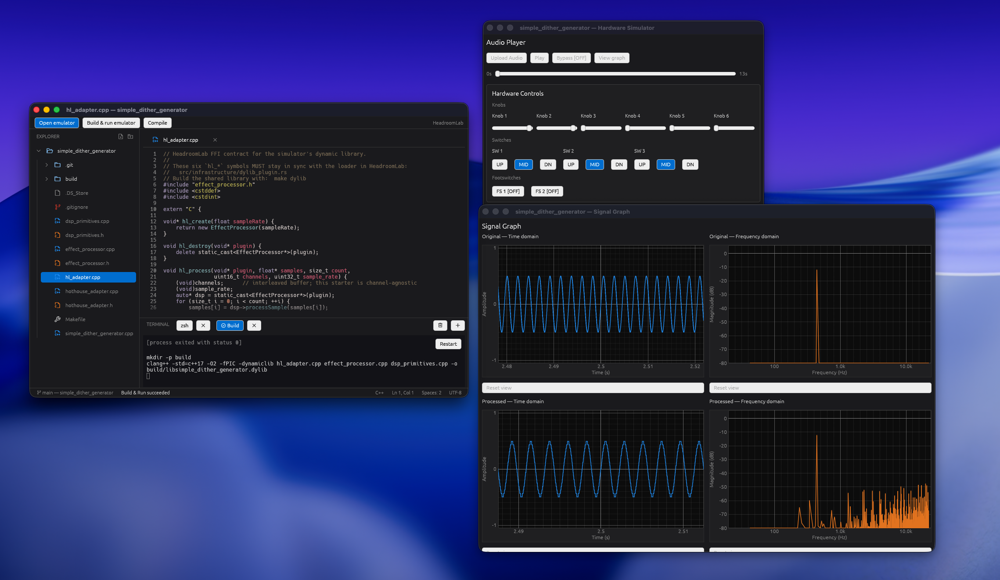

<h1 align="center">HeadroomLab</h1>

<p align="center">
  
</p>

<p align="center">
  <em>Write, build and audition guitar-pedal DSP effects on your desktop, with no pedal hardware needed.</em>
</p>

<p align="center">
  
</p>

---

## Description

HeadroomLab is a desktop app for writing and testing guitar-pedal DSP effects. It is built for macOS first and also runs on Linux and Windows through `cpal` and `eframe`.

You write an effect in C++ and compile it into a shared library (`.dylib` / `.so` / `.dll`) that implements a small C-ABI contract. HeadroomLab loads that library, plays an audio file through it in real time, and lets you control it from a UI that matches a physical pedal layout. The current layout is the [Cleveland Music Co. Hothouse](https://clevelandmusicco.com/hothouse-diy-digital-signal-processing-platform-kit/): 6 knobs, 3 three-way switches and 2 footswitches.

Features:

- **Project generator.** Creates a Hothouse-ready C++ project with the DSP scaffolding, the HeadroomLab FFI adapter, the Hothouse firmware entry point and a `Makefile` that builds both the simulator library and the firmware.
- **Code editor.** Includes a file explorer, tabs with unsaved-change markers, syntax highlighting, find, and the usual editor shortcuts.
- **Built-in terminal.** A real PTY terminal docked in the editor window.
- **Build & Run / Compile.** *Build & Run* runs `make dylib` and opens the result in the hardware simulator. *Compile* runs `make` to build the firmware. Compiler errors and warnings from GCC, Clang and MSVC are parsed and shown in a problems strip.
- **Hardware simulator.** Loads the effect library, plays an audio file through it, and lets you turn knobs, flip switches and press footswitches while it plays. Includes transport controls (load / play / pause / bypass).
- **Signal graph.** A second window that plots time-domain waveforms and FFT spectra of the original and processed signal side by side. It re-renders as you move the controls.
- **Recent projects, a native macOS menu bar** (an egui menu bar on Windows and Linux) **and a self-updater** that installs new versions from GitHub Releases.

## Audio file requirements

Audio files loaded into the simulator **must** meet these requirements:

| Requirement | Value |
|---|---|
| Length | **Between 1 and 12 seconds** |
| Sample rate | **48 kHz** (48 000 Hz) |
| Formats | WAV, MP3, OGG |
| Bit depth | 16-bit or 32-bit |

A file that doesn't meet these requirements is rejected when you load it.

## Architecture

HeadroomLab uses **Domain-Driven Design** and **clean architecture**. The layers follow a hexagonal (ports-and-adapters) layout: the domain is at the center and depends on nothing outside itself, and each layer depends only on the layers below it. UI components follow **Atomic Design**.

```
┌──────────────────────────────────────────────────────────────┐
│ presentation/   egui/eframe UI · windows · controllers       │
│                 components: atoms / molecules / organisms    │
├──────────────────────────────────────────────────────────────┤
│ infrastructure/ cpal · symphonia · libloading · PTY · notify │
│                 GitHub updater · project templates           │
├──────────────────────────────────────────────────────────────┤
│ application/    services + ports (traits the UI depends on)  │
├──────────────────────────────────────────────────────────────┤
│ domain/         pure types & logic: no IO, no UI, no FFI     │
└──────────────────────────────────────────────────────────────┘
```

The four modules under `src/` are listed below. Each one depends only on the modules listed after it.

- **`domain/`**: pure types and logic. This includes `AudioTrack` (with its validation rules), the `AudioProcessor` and `EffectPlugin` traits, `PluginError`, the `HardwarePlatform` trait, and `Waveform` / `Spectrum` with the FFT math in `signal.rs`. It also contains the editor, diagnostics, terminal, menu, project and update models. There is no IO, UI or FFI in this layer.
- **`application/`**: services and ports. `AudioEnginePort` is the trait the UI depends on. `SimulatorService` owns the loaded plugin and forwards knob, switch and footswitch changes to it. `GraphService` owns the control snapshot used to re-render the processed signal. `GraphComputeWorker` computes graph data on a dedicated background thread, and only the newest request is kept. This layer also has the file-system, recent-projects and update services.
- **`infrastructure/`**: concrete adapters. This includes `AudioEngine` (a cpal output stream plus an interleaved f32 PCM buffer), `audio_decoder` (symphonia), `DylibPlugin` and `SharedPluginProcessor` (libloading FFI), `HothouseHardware`, the PTY terminal, the file watcher, the clipboard, the project generator and the GitHub updater.
- **`presentation/`**: the egui/eframe UI. `HeadroomApp` is the eframe `App`. Child windows (editor, simulator, graph) are egui **viewports** tracked by `WindowManager` and driven by their controllers.

`main.rs` is the **only composition root**. It creates the concrete adapters, hides each one behind its port (for example `Rc<dyn AudioEnginePort>`), and passes them to `HeadroomApp`. No other code chooses a concrete implementation.

### Plugin ownership & threading

The effect library is loaded on the UI thread and wrapped in `Arc<Mutex<DylibPlugin>>`. Two parts of the app hold a clone:

1. **`SimulatorService`** locks it when a control changes. This path isn't real-time.
2. **`SharedPluginProcessor`** sits in the `AudioEngine` processor chain. The cpal audio callback locks it once per buffer.

The graph window does **not** use the live plugin. `compute_graph_data` loads a separate, temporary instance of the library, applies the current control snapshot to it, processes the whole buffer once, and then drops it. As a result, moving a knob for the graph doesn't affect live playback.

`AudioSnapshot` shares the decoded buffer through `Arc<Vec<f32>>`. Taking a snapshot for the graph is O(1) and never blocks the audio callback.

### UI loop

`HeadroomApp` requests a repaint every 100 ms so the playhead and the graph worker keep updating without user input. On each tick, the graph session checks the worker for a finished result. It submits a new job only when the worker is idle and the control snapshot has changed since the last job. While you drag a knob, the next job always uses the newest snapshot, and old jobs don't pile up in a queue.

## Effect FFI contract

Every effect library must export these C-ABI symbols. Projects created by HeadroomLab already export them in `hl_adapter.cpp`.

```c
void*    hl_create(float sampleRate);
void     hl_destroy(void* plugin);
void     hl_process(void* plugin, float* samples, uintptr_t count, uint16_t channels, uint32_t sample_rate);
void     hl_set_knob(void* plugin, uint32_t index, float value);        /* 0.0..1.0 */
void     hl_set_switch(void* plugin, uint32_t index, int32_t position);  /* 0=UP 1=MID 2=DOWN */
void     hl_set_footswitch(void* plugin, uint32_t index, bool pressed);
```

`hl_process` works on **interleaved f32 PCM** samples in the range `[-1, 1]`. If any symbol is missing, the library is rejected with `PluginError::InvalidPlugin`.

## Dependencies

### Toolchain

- **Rust** (stable, with **edition 2024** support, i.e. Rust 1.85 or newer). Install it with [rustup](https://rustup.rs).
- **A host C++ compiler** (`clang++` by default) and **`make`** to build effect libraries with `make dylib`.
- *(Optional)* To build Hothouse **firmware** with *Compile*, you need the ARM embedded toolchain (`arm-none-eabi-gcc`) and a checkout of [HothouseExamples](https://github.com/clevelandmusicco/HothouseExamples) (with libDaisy and DaisySP). Generated projects expect it at `../../HothouseExamples`. You can override this with `HOTHOUSE_DIR`.

Platform notes:

- **macOS**: install the Xcode Command Line Tools (`xcode-select --install`).
- **Linux**: install the ALSA development headers and `pkg-config` (on Debian/Ubuntu: `sudo apt install libasound2-dev pkg-config`).
- **Windows**: install [Git for Windows](https://git-scm.com/download/win), which provides the shell used for builds, and a C++ toolchain.

### Rust crates

| Crate | Purpose |
|---|---|
| `eframe` / `egui_extras` / `egui_plot` / `egui-phosphor` | UI framework, syntax highlighting, plots, icon font |
| `cpal` | Cross-platform real-time audio output |
| `symphonia` | Audio decoding (WAV, MP3, Vorbis, AAC) |
| `libloading` | Loading the effect `.dylib` / `.so` / `.dll` at runtime |
| `rustfft` | FFT for the spectrum view |
| `rfd` | Native file dialogs |
| `alacritty_terminal` | Terminal emulation for the built-in terminal |
| `notify` | File-system watching for the explorer |
| `arboard` | Clipboard access |
| `trash` / `opener` | Move-to-trash and "reveal in file manager" |
| `directories` / `serde` / `serde_json` | Storing recent projects |
| `self_update` / `reqwest` / `tempfile` | Self-updating from GitHub Releases |
| `png` | Decoding the window icon |
| `neurodoom` | 🤫 |
| `muda` *(macOS only)* | Native menu bar |
| `winresource` *(Windows build only)* | Embedding the `.exe` icon |

## Running the app

```sh
git clone https://github.com/jesusherrera94/HeadroomLab.git
cd HeadroomLab

cargo run              # debug build
cargo run --release    # optimized build (slower to compile: LTO + codegen-units = 1)
```

Other useful commands:

```sh
cargo check     # fast type-check while iterating
cargo clippy    # lint
cargo fmt       # format
cargo test      # run the unit tests
```

Automatic updates are **turned off in debug builds**, so `cargo run` never connects to the network. See [RELEASING.md](RELEASING.md) for packaging, release publishing and testing the updater.

### Typical workflow

1. **Create a new project** from the start window. Give it a name and choose a folder.
2. **Write your effect** in `effect_processor.cpp` / `dsp_primitives.cpp` in the editor.
3. Click **Build & Run**. HeadroomLab runs `make dylib` in the built-in terminal and opens the hardware simulator with the new library loaded.
4. **Load an audio file** (1–12 s, 48 kHz) and press play. Turn the knobs, flip the switches and use the footswitches to hear your changes live.
5. Open **View Graph** to compare the original and processed waveforms and spectra.
6. When you're happy with the sound, click **Compile** to build the Hothouse firmware.

## Pending tasks

### Audio & simulator

- [ ] Enforce the 1–12 second audio length in `AudioTrack` validation (it currently allows up to 15 s and has no minimum).
- [ ] Support more hardware layouts through the `HardwarePlatform` trait (only the Hothouse exists today).
- [ ] Flash firmware from the app (`make program-dfu` / DFU).

### Editor

- [ ] Find and replace.
- [ ] Multiple cursors, select all occurrences, and move line up/down.
- [ ] Tab keyboard navigation (`Cmd+W`, `Ctrl+Tab`, `Cmd+1..9`) and Close Others / Close All.
- [ ] Restore open tabs when a project is reopened.
- [ ] Live, as-you-type diagnostics (language server), gutter markers and hover tooltips.

### Terminal

- [ ] Split panes and terminal search.
- [ ] Configurable shell and font.
- [ ] Fix a bug when typing on the terminal and delete action.

### Release & platform

- [ ] CI and automated releases.
- [ ] Code signing and notarization (macOS) and signing on Windows.
- [ ] Testing on Windows and Linux.
- [ ] Windows installer and Linux AppImage / distro packages.
- [ ] Taskbar icon under Linux/Wayland (needs an `app_id` that matches the `.desktop` entry).
- [ ] Fix a bug when the app goes to the background or the app locks when it is unactive.

## Credits

- **Author**: [Jesus Herrera](https://github.com/jesusherrera94)
- **Hardware platform**: [Cleveland Music Co. Hothouse](https://clevelandmusicco.com/) and [HothouseExamples](https://github.com/clevelandmusicco/HothouseExamples)
- **Embedded DSP stack**: [Electrosmith](https://electro-smith.com/) Daisy, [libDaisy](https://github.com/electro-smith/libDaisy) and [DaisySP](https://github.com/electro-smith/DaisySP)
- **UI**: [egui / eframe](https://github.com/emilk/egui) by Emil Ernerfeldt and contributors
- **Audio**: [cpal](https://github.com/RustAudio/cpal), [symphonia](https://github.com/pdeljanov/Symphonia) and [RustFFT](https://github.com/ejmahler/RustFFT)
- **Terminal**: [alacritty_terminal](https://github.com/alacritty/alacritty)
- Thanks to everyone who maintains the open-source crates listed in [Dependencies](#dependencies).
